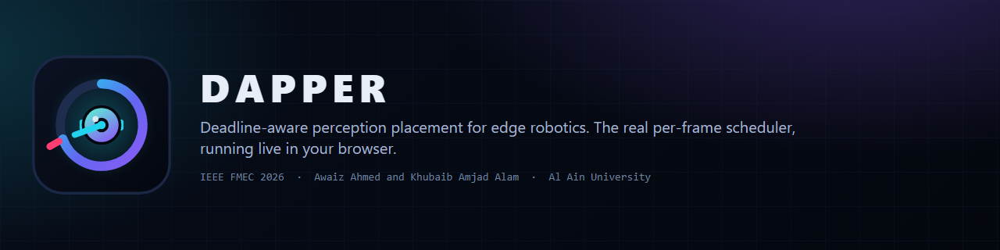
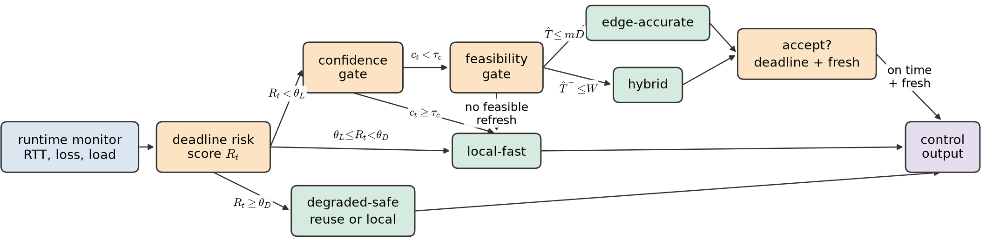
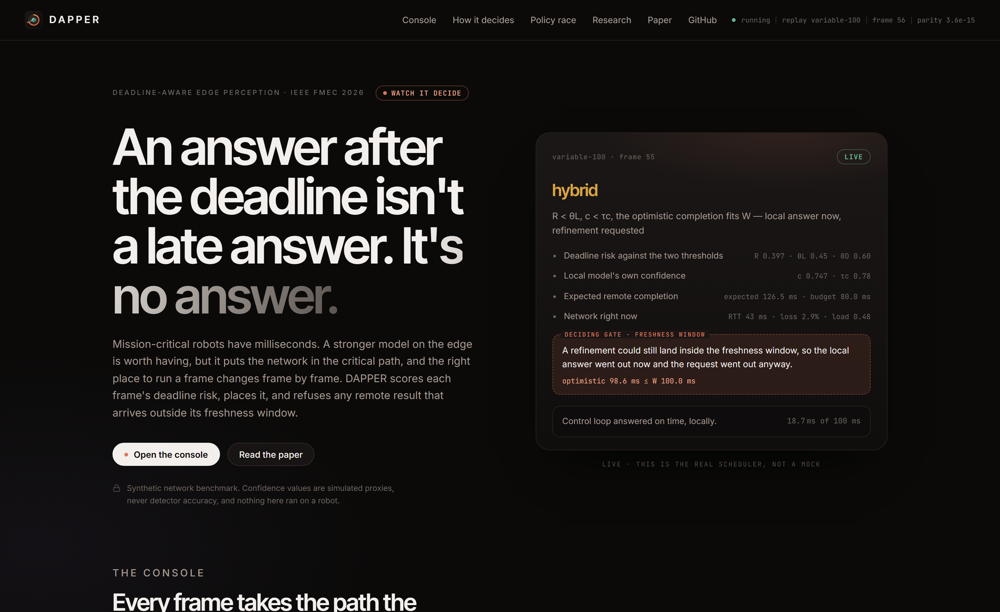
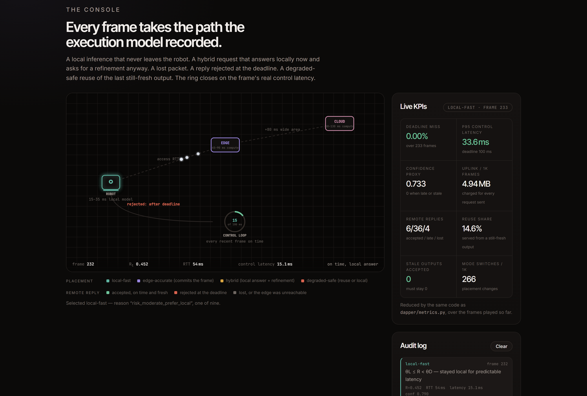
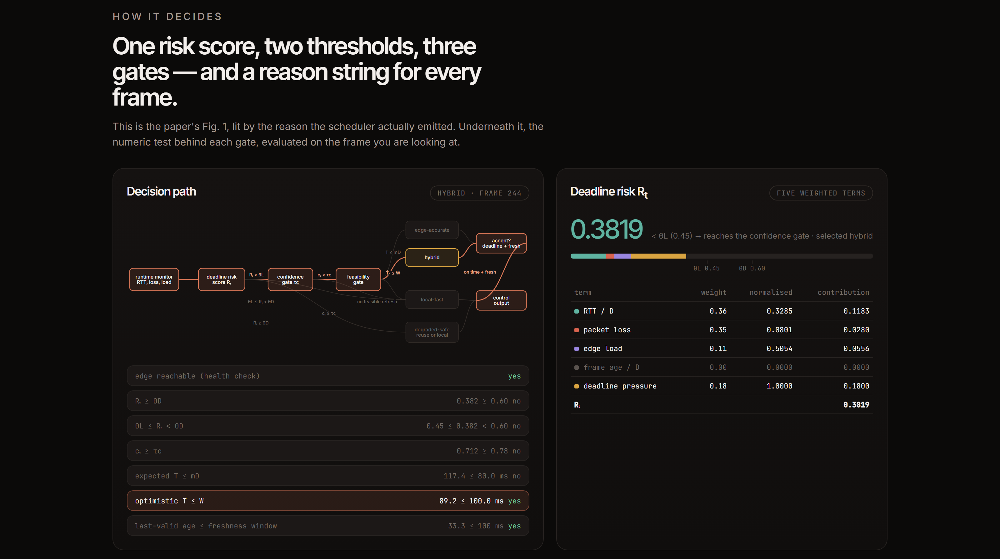
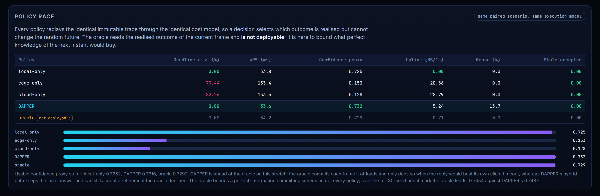

<div align="center">

<picture>
  
</picture>

**A robot's perception has to beat the clock. DAPPER decides, frame by frame, whether to think on board, ask the edge, do both, or fall back — and it refuses any answer that arrives too late to use.**

[](https://4waiz.github.io/Dapper/)
[](https://4waiz.github.io/Dapper/paper/)
[](https://github.com/4waiz/Dapper/actions/workflows/ci.yml)
[](https://github.com/4waiz/Dapper/actions/workflows/ci.yml)

[**Live dashboard**](https://4waiz.github.io/Dapper/) &nbsp;·&nbsp; [**Paper**](https://4waiz.github.io/Dapper/paper/) &nbsp;·&nbsp; [**How it works**](#how-it-works) &nbsp;·&nbsp; [**Results**](#results) &nbsp;·&nbsp; [**Quick start**](#quick-start) &nbsp;·&nbsp; [**Limitations**](#scope-and-limitations)

</div>

---

Mission-critical robots cannot separate *how good* a perception result is from *when* it arrives. A confident detection that lands after the control loop has already acted is not a better answer — it is no answer. Remote inference offers a stronger model than anything that fits on the robot, but it puts the network in the critical path, and the right place to run a frame changes from one frame to the next: always offloading collapses during a congestion burst, always staying local gives away quality on a healthy link.

**DAPPER** is a deterministic, auditable per-frame scheduler for that decision. Every frame gets a numeric deadline-risk score, a placement, and a reason string drawn from a closed set of nine — no learned policy, no hidden state, nothing that cannot be replayed and explained from its logged inputs.

This repository is the reproducible research artifact for the IEEE FMEC 2026 paper, and it also runs the scheduler live in your browser.

## How it works

<p align="center"></p>

For each frame the runtime monitor reports round-trip time, packet loss, normalised edge load, frame age and edge availability. Five normalised signals combine into a deadline-risk score `R` in [0, 1], and two thresholds route the frame:

| Condition | Placement | What it costs |
|---|---|---|
| `R ≥ θD` | **degraded-safe** — reuse the last still-fresh output, else run locally | nothing on the network |
| `θL ≤ R < θD` | **local-fast** — predictable on-device latency | nothing on the network |
| `R < θL`, local confidence `c ≥ τc` | **local-fast** — the small model is already sure enough | nothing on the network |
| `R < θL`, `c < τc`, expected remote completion `T̂ ≤ mD` | **edge-accurate** — commit the frame to the network | no local answer is kept |
| `R < θL`, `c < τc`, optimistic completion `T̂⁻ ≤ W` | **hybrid** — answer locally *now*, accept a refinement only if it really lands in time | one upload, always charged |
| otherwise | **local-fast** — a refresh would be rejected on arrival, so nothing is sent | nothing on the network |

Three properties follow from the structure rather than from tuning:

- **A remote result is never waited for.** Only `edge-accurate` commits a frame, and at the paper's 100 ms deadline it is never selected — every offload is hybrid, which keeps a local answer in hand.
- **Stale output is never consumed.** A result outside its freshness window is rejected, and the test suite asserts this end to end rather than leaving it as a claim.
- **Failed offloads are paid for.** Every transmitted request is charged its upload bandwidth even when the packet is lost or the reply arrives too late to accept. That is what makes the bandwidth column below honest.

## Results

<!-- RESULTS:START -->
At the calibrated **100 ms** control deadline, over **1.2 million frame-level decisions** (30 seeds x 1,000 frames x five profiles x eight policies):

| Profile | Policy | p95 latency (ms) | Deadline miss | Confidence proxy | Uplink (MB/1k frames) |
|---|---|---|---|---|---|
| Stable | local-only | 34.0 | 0.00% | 0.725 | 0.00 |
|  | edge-only | 132.8 | 48.77% | 0.448 | 25.00 |
|  | cloud-only | 134.0 | 100.00% | 0.000 | 35.00 |
|  | **DAPPER** | **34.0** | **0.00%** | **0.796** | **21.62** |
| Congested | local-only | 33.9 | 0.00% | 0.725 | 0.00 |
|  | edge-only | 133.9 | 100.00% | 0.000 | 25.00 |
|  | cloud-only | 133.9 | 100.00% | 0.000 | 35.00 |
|  | **DAPPER** | **33.9** | **0.00%** | **0.725** | **0.00** |
| Lossy | local-only | 34.0 | 0.00% | 0.725 | 0.00 |
|  | edge-only | 133.9 | 87.51% | 0.109 | 25.00 |
|  | cloud-only | 134.0 | 100.00% | 0.000 | 35.00 |
|  | **DAPPER** | **34.0** | **0.00%** | **0.741** | **18.13** |
| Variable | local-only | 34.0 | 0.00% | 0.725 | 0.00 |
|  | edge-only | 133.6 | 74.00% | 0.195 | 19.55 |
|  | cloud-only | 133.7 | 78.20% | 0.158 | 27.37 |
|  | **DAPPER** | **33.7** | **0.00%** | **0.732** | **5.78** |
| Outage | local-only | 34.0 | 0.00% | 0.725 | 0.00 |
|  | edge-only | 128.1 | 14.68% | 0.619 | 3.67 |
|  | cloud-only | 128.1 | 14.68% | 0.619 | 5.14 |
|  | **DAPPER** | **31.2** | **0.00%** | **0.726** | **0.00** |

DAPPER holds a **0.00% deadline-miss rate on every profile** while keeping tail latency at local-inference levels, and across all 1,200 runs the rate at which an output older than its freshness window is accepted is **0.00%**. It is not free: under the stable profile it spends **21.62 MB per 1,000 frames**, of which only 51.2% of requests return a usable reply, and the frozen 100-ms calibration produces 5.24%, 13.31% and 4.21% misses at D = 125, 150 and 200 ms. Full tables, ablations and limitations are in the [paper](https://4waiz.github.io/Dapper/paper/).
<!-- RESULTS:END -->

Full tables, the ablations, the sensitivity sweeps and the secondary YOLO11n/YOLO11m study on COCO val2017 are in the [paper](https://4waiz.github.io/Dapper/paper/). Every figure and table there is generated from a CSV under `results/`; `experiments/verify_paper_claims.py` re-checks all 426 numeric claims in the camera-ready against those files and exits non-zero on a disagreement.

## The live console

[**The console**](https://4waiz.github.io/Dapper/) runs the real scheduler in your browser — a JavaScript port of `dapper/scheduler.py`, `dapper/executor.py`, `dapper/policies.py` and `dapper/metrics.py`, not a mock. It replays the same immutable scenario traces the 30-seed benchmark replayed, and on boot it re-derives the metrics Python recorded for the loaded trace and prints the worst disagreement in the status bar. It currently reads **3.6 × 10⁻¹⁵**.

<p align="center"></p>

The card on the right is the frame the scheduler is on right now: what it chose, why, what each gate saw, and the one test that settled it.

<p align="center"></p>

Each frame travels the path the execution model actually recorded: a local inference that never leaves the robot, a hybrid request that returns an immediate local answer while a refinement is in flight, a lost packet, a reply rejected at the deadline, a degraded-safe reuse of the last still-fresh output. The deadline ring closes on the frame's real control latency.

<p align="center"></p>

The paper's Fig. 1 lights up per frame with the gate that fired and the numeric test behind it — `R` against `θL`/`θD`, `c` against `τc`, `T̂ ≤ mD`, `T̂⁻ ≤ W` — and `R` is broken into its five weighted terms.

<p align="center"></p>

Five policies race on the identical paired trace through the identical cost model. The offline oracle is labelled **not deployable**: it reads the realised outcome of the current frame and exists only to bound what perfect knowledge of the next instant would buy.

Drag the control deadline from 50 to 250 ms to watch the mode shift the paper reports in Fig. 3a — and the misses the frozen 100 ms calibration produces past it. Bias the RTT or edge-compute estimates to reproduce Fig. 3b. Switch off the confidence gate, the freshness gate or degraded reuse to reproduce a row of Table V.

## Quick start

```bash
pip install -r requirements.txt
python -m pytest -q                       # 69 tests, the camera-ready suite
python experiments/run_camera_ready.py --quick --skip-real-detector
```

Serve the dashboard locally:

```bash
python -m http.server 8765 --directory site
```

## Full reproduction

```bash
python experiments/run_camera_ready.py --full
```

`--full` runs the exact camera-ready protocol — 30 seeds × 1,000 frames × 5 profiles × 8 policies, plus the ablations, the sweeps and the overhead study — and takes roughly 30 minutes on a desktop CPU.

Everything seeded is deterministic: identical commands on the same commit reproduce identical CSVs, because every stochastic quantity comes from a pre-generated scenario trace and the bootstrap has a fixed seed. Two exceptions are worth stating plainly rather than discovering:

- `results/overhead/*` records wall-clock timings and the figure PDFs carry a creation timestamp, so neither is byte-reproducible.
- The real-detector stage needs a CUDA GPU and the cached COCO predictions. On a CPU-only machine pass `--skip-real-detector`; without it the stage fails **and truncates** `results/real_detector/per_image_quality.parquet` on the way out.

Individual stages:

```bash
python experiments/calibrate_scheduler.py     # parameter selection (seeds 0-9)
python experiments/final_eval.py              # 30-seed evaluation (seeds 100-129)
python experiments/ablation.py                # risk-signal + mechanism ablations
python experiments/sensitivity.py             # deadline, threshold, estimation, margin
python experiments/overhead.py                # scheduler decision cost
python experiments/make_figures.py            # results/paper_figures/
python experiments/make_tables.py             # results/paper_tables/
python experiments/make_reports.py            # artifacts/*.md
```

Rebuild the web artifacts:

```bash
python experiments/export_web_config.py       # site/data/config.json  (Table I)
python experiments/export_web_traces.py       # site/data/traces/      (immutable scenarios)
python experiments/export_web_results.py      # site/data/results.json (Tables III-VII)
python experiments/build_paper_page.py        # site/paper/ + the README results block
python -m pytest tests_web -q                 # the browser engine against Python, to 1e-9
node scripts/build_assets.mjs                 # icons and banner from site/assets/logo.svg
node scripts/capture_console.mjs              # screenshots, and a smoke test
node scripts/verify_site.mjs <url>            # assets, JSON and console on a deployed site
bash scripts/deploy_pages.sh                  # publish site/ to gh-pages
```

Optional real-detector study (CUDA GPU, ~1 GB download):

```bash
python real_validation/prepare_dataset.py          # COCO val2017 + YOLO labels
python real_validation/collect_detector_outputs.py --cpu-subset-local -1
python real_validation/evaluate_detection.py
python real_validation/replay_dapper.py
```

## What to read next

| File | What it is |
|---|---|
| [artifacts/CAMERA_READY_RESULTS.md](artifacts/CAMERA_READY_RESULTS.md) | The full result narrative, generated from the CSVs |
| [artifacts/CLAIM_EVIDENCE_MATRIX.md](artifacts/CLAIM_EVIDENCE_MATRIX.md) | Every claim, its evidence, and the claims the data does **not** support |
| [artifacts/PARAMETER_CHANGELOG.md](artifacts/PARAMETER_CHANGELOG.md) | Every parameter change and its justification |
| [artifacts/ENVIRONMENT.md](artifacts/ENVIRONMENT.md) | The machine and the package versions the released results were produced on |
| [artifacts/baseline_original/BASELINE_AUDIT.md](artifacts/baseline_original/BASELINE_AUDIT.md) | Audit of the originally published implementation |
| [results/calibration/calibration_report.md](results/calibration/calibration_report.md) | How the weights and thresholds were selected |

## Experimental design

* **Paired scenarios.** For each (seed, profile), the *potential* outcome of every execution site on every frame — latency, confidence, detections and the loss draw — is generated in advance from 15 independent random streams. All policies replay the identical trace, so a decision selects which outcome is realised but cannot change the random future. Comparisons are paired at frame granularity; `results/final/scenario_fingerprints.csv` lets a reviewer verify that a replay used the same scenarios.
* **Disjoint seeds.** Parameters are selected on seeds 0–9 and never on the evaluation seeds 100–129. The split is enforced in code.
* **Seed-level statistics.** Frames within a run are autocorrelated, so the seed is the unit of replication. All intervals are percentile bootstrap over seeds with a fixed bootstrap seed, and policy pairs are compared seed by seed.
* **One shared execution model.** No policy has a private cost model. Every transmitted offload is charged its upload bandwidth, including requests that are lost or whose reply arrives too late to accept, and a failed request costs a deadline-bounded client timeout before the local fallback runs.

## Repository layout

```
dapper/              the corrected implementation
  config.py            configuration loading + invariant checks
  scenario.py          immutable pre-generated per-frame scenarios
  scheduler.py         the DAPPER decision rule
  policies.py          all policies, adaptive baselines, offline oracle
  executor.py          shared timing / bandwidth / freshness accounting
  metrics.py           per-run metric reduction
  stats.py             seed-level bootstrap confidence intervals
  trace.py             trace-driven network input
experiments/         one driver per phase, plus run_camera_ready.py
  verify_paper_claims.py   every camera-ready number against results/
  export_web_*.py          the frozen config, the traces and the results, for the browser
  build_paper_page.py      the web edition of the paper and the posted PDF
real_validation/     optional YOLO11n / YOLO11m study on COCO val2017
site/                the live dashboard and the paper page (no build step)
  js/                  the scheduler, executor, policies and metrics, ported to JavaScript
  data/                config.json, results.json and the immutable scenario traces
  paper/               the camera-ready in IEEE style, and the posted PDF
scripts/             asset build, screenshots, JS parity, site verification, deploy
tests/               the 69 tests the paper cites, unchanged
tests_web/           the browser engine against Python (a separate, additive suite)
legacy/              the published prototype, frozen and still reproducible
artifacts/           generated reports and the frozen baseline snapshot
results/             every generated CSV, figure and table
paper/               the camera-ready LaTeX source, the certified PDF, the web template
```

`python -m pytest -q` collects exactly the 69 tests the paper cites; `pytest.ini` pins that. The web-engine suite is a separate run, `python -m pytest tests_web -q`, so a post-camera-ready addition cannot quietly change a number the manuscript states.

## Reproducing the originally published results

The published prototype is frozen under `legacy/` and still reproduces the FMEC 2026 submission numbers exactly:

```bash
python -m legacy.benchmark --config legacy/config_original.yaml run-all \
    --frames 500 --deadline-ms 100 --seed 42 --out-dir artifacts/baseline_original
```

`artifacts/baseline_original/BASELINE_AUDIT.md` documents twelve confirmed implementation defects in that version and what each one did to the reported numbers.

## Scope and limitations

These are the limitations exactly as the paper states them.

* The main benchmark uses **parameterised synthetic profiles**, not measured Wi-Fi, 5G or private-edge traces. Trace replay is implemented and tested, but no measured trace was collected, so no result rests on one.
* The synthetic confidence metric is a **proxy, not detector accuracy**. The secondary detector experiment removes that limitation but still replays synthetic networking, with both models measured on one workstation rather than embedded hardware.
* The timing model **does not simulate queue buildup** between frames.
* **Energy is not instrumented**, physical switching cost is not modelled, and no hazard analysis or formal safety guarantee is provided — *degraded-safe* denotes conservative fallback behaviour only.
* Parameters are calibrated at **D = 100 ms**, and the larger-deadline results show that the frozen configuration should not be assumed valid for all control budgets.

Nothing here ran on a robot or on embedded hardware.

## Citation

The paper:

```bibtex
@inproceedings{ahmed2026dapper,
  author    = {Ahmed, Awaiz and Alam, Khubaib Amjad},
  title     = {{DAPPER}: Deadline-Aware Edge Perception for Mission-Critical
               Robots under Dynamic Network Conditions},
  booktitle = {Proceedings of the 2026 IEEE International Conference on Fog and
               Mobile Edge Computing (FMEC)},
  year      = {2026},
  publisher = {IEEE},
  note      = {To appear}
}
```

The software artifact:

```bibtex
@software{ahmed2026dapper_artifact,
  author  = {Ahmed, Awaiz},
  title   = {{DAPPER}: research artifact and live scheduler dashboard},
  year    = {2026},
  url     = {https://github.com/4waiz/Dapper}
}
```

The paper text is under IEEE copyright; `site/paper/dapper-fmec2026.pdf` is the accepted manuscript, posted with IEEE's standard notice.

<div align="center">

Built by **Awaiz Ahmed**.

</div>
